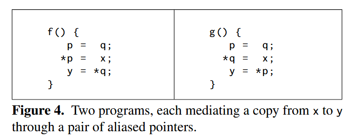

# retypd in pointer (Saturation rule)

ReachingSet的含义：子类型关系推理需要 暂时去掉tag，走子类型，然后加回来之前的tag。ReachingSet表示暂时去掉tag的这一个过程。也代表着类型能力的传递。

- ReachingSet对应了MLsub里面的普通的边。

- 基于子类型边的传递reaching set

retypd的指针分析在于基于指针的数据流。指针的赋值可以优先逆着指针数据流到最上游，然后再顺着数据流走到所有可达的指针节点。使得整个群组里，任何store都是任何load的子类型。因为，只要有指针之间赋值，就有可能都指向一个对象。

从指针分析加类型分析的视角，指针分析中如果确实有这么一个对象沿着指针数据流传到了下游，然后被存入的值会直接和对象产生约束。然后对象如果从上游沿着其他数据流传，被使用的时候数据流也直接关联到对象。
